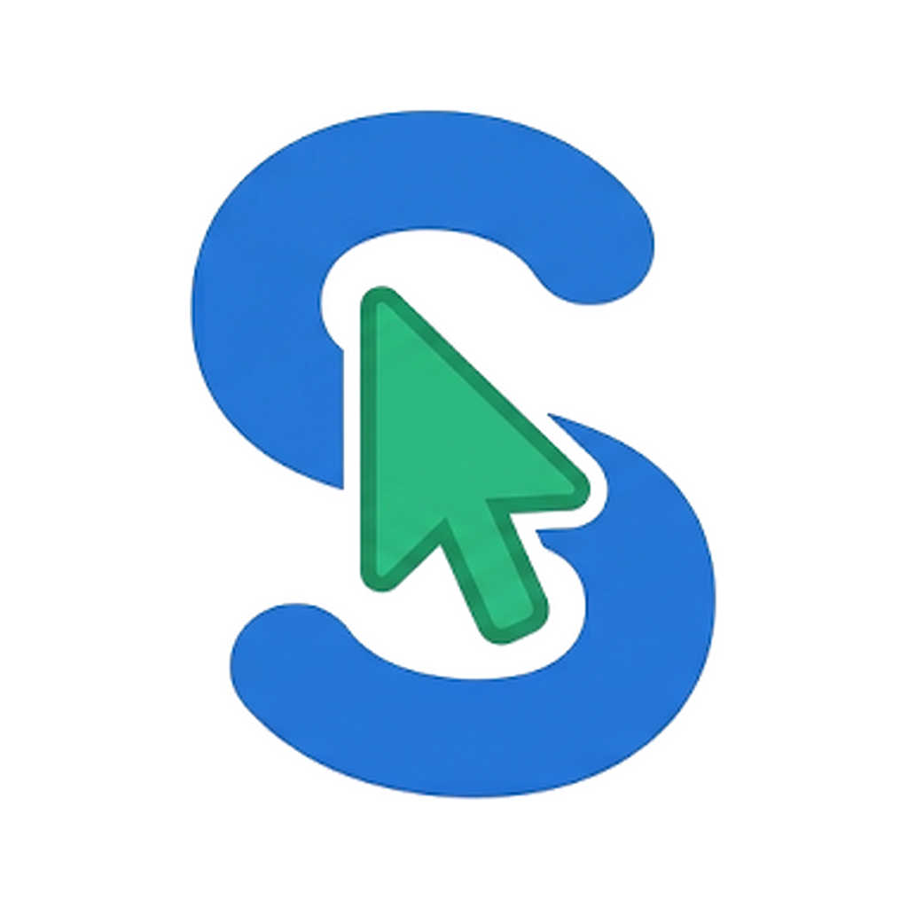
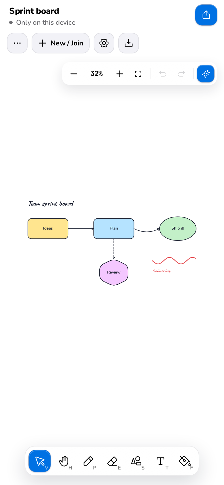

# Shareboard for Android

### A whiteboard for everyone, in seconds. No account required.

The Shareboard Android app. Draw with your fingers, share with a code. Sketch, diagram and brainstorm on an infinite board, alone or live with
anyone who has the code.

[Download](#install) · [Features](#what-you-can-do) · [User guide](docs/user-guide/getting-started.md) · [Documentation](docs/README.md) · [Changelog](CHANGELOG.md)

 

 

## What is Shareboard?

Shareboard is a collaborative whiteboard. Open it and you are already on a
board: pick the pencil and draw. When you want company, press **Share** and
send the six-character code, the link or the QR code. Everyone who opens it
draws on the same board at the same time and sees each other's cursors live.

There is nothing to sign up for. Your first board lives on your device and
works without internet; sharing it puts a copy online. Boards you share can be
public or protected with a PIN, and you decide who may edit and who may only
watch.

This repository is the **Android app**. The same boards open in the [web app](https://github.com/Juan17la/shareboard_web) at <https://shareboard-web.vercel.app>, and both talk to the [Shareboard server](https://github.com/Juan17la/shareboard_server).

 

## What you can do

<table>
<tr>
<td width="50%" valign="top">

**Draw anything**

Pencil with smoothing, rectangles, circles, triangles, polygons, lines, arrows,
text and pictures, on an infinite canvas with a dot grid.

</td>
<td width="50%" valign="top">

**Draw together, live**

Every stroke appears for everyone a moment later, with named cursors and a list
of who is here. What someone has selected is theirs until they let go.

</td>
</tr>
<tr>
<td valign="top">

**Diagrams that stay connected**

Arrows snap to figures and follow them when they move: straight, curved or
elbow, with 15 end styles including database crow's feet.

</td>
<td valign="top">

**Draw to shape**

Scribble a rough box, circle, triangle or arrow and it becomes a clean figure.

</td>
</tr>
<tr>
<td valign="top">

**Draw with AI**

Describe it ("a login flow", "a house with a tree") and get an editable
drawing, with a preview before it lands.

</td>
<td valign="top">

**Share in one tap**

A short code, a link and a QR code. Public, or private with a 4-digit PIN.
Everyone edits, only chosen people, or only you.

</td>
</tr>
<tr>
<td valign="top">

**Exports that stay editable**

PNG, JPG, SVG or JSON. A picture exported from Shareboard carries the board
inside, so importing it back makes everything editable again.

</td>
<td valign="top">

**Works offline**

Your own board is always there, even without internet. Share it when you are
ready; it stays as your private copy.

</td>
</tr>
</table>

Also: undo and redo, copy and paste between boards, grouping, layers, rotation,
four typefaces, rounded corners, dashed and dotted lines, a light and a dark
board, Spanish and English, and a short tutorial for first-time users.
- **Made for touch:** one finger draws, two fingers move and zoom, hold an
  element for its menu, and gentle vibration on the tools.

 

## Install

1. On your Android phone, open the
   [latest release](https://github.com/Juan17la/shareboard_mobile/releases/latest)
   and download `shareboard-v….apk`.
2. Open the file. Allow your browser to **install unknown apps** when Android
   asks (the app is not on the Play Store yet).
3. Tap **Install**, then **Open**.

The app tells you when a new version is out and downloads it for you. There is
no iPhone app: on iPhone and iPad use the
[web version](https://shareboard-web.vercel.app), which does everything the
app does.

To build it yourself, see [Building and running](docs/development/building.md).

 

## How to use it

1. **Draw.** Pick a tool from the toolbar and draw. Two fingers (or the mouse
   wheel) move the board; pinch (or Ctrl + wheel) zooms.
2. **Edit.** With the cursor, tap something to select it, then move, resize or
   rotate it, or change its colour and style in the options strip.
3. **Share.** Press **Share** and send the code, the link or the QR code.
4. **Join.** Someone sent you a code? **+ New / Join → Join with a code**.
5. **Save.** The download button exports a picture or a file you can import
   later.

The [user guide](docs/user-guide/features.md) explains every tool and option.

 

## Good to know

- **No account, no tracking.** Each device gets a random id; you choose a
  nickname. Nothing else about you is collected.
- **Shared boards live on the server** so anyone with the code can come back
  to them. Your device's own board never leaves it unless you share it.
- **The first visit of the day can be slow.** The server sleeps when nobody
  uses it and takes up to a minute to wake up.
- **Private boards** need their PIN to enter. Only the board's creator can see
  it and change who may edit.

 

## Documentation

| I want to... | Read |
|--------------|------|
| Learn how to use Shareboard | [Getting started](docs/user-guide/getting-started.md) · [Features](docs/user-guide/features.md) |
| Fix a problem | [Troubleshooting](docs/user-guide/troubleshooting.md) |
| Understand how it works inside | [Documentation index](docs/README.md) |
| Run it on my machine | [Building and running](docs/development/building.md) |

 

## License

Shareboard is source-available under the
[PolyForm Noncommercial License 1.0.0](LICENSE). You are free to use it, read
the code, modify it and share it for any noncommercial purpose. Selling it, or
using it or any part of it to make money, is reserved to the author. For
commercial permission, open an issue or contact
[@Juan17la](https://github.com/Juan17la).

 
Made by Juan Diego López Arias

