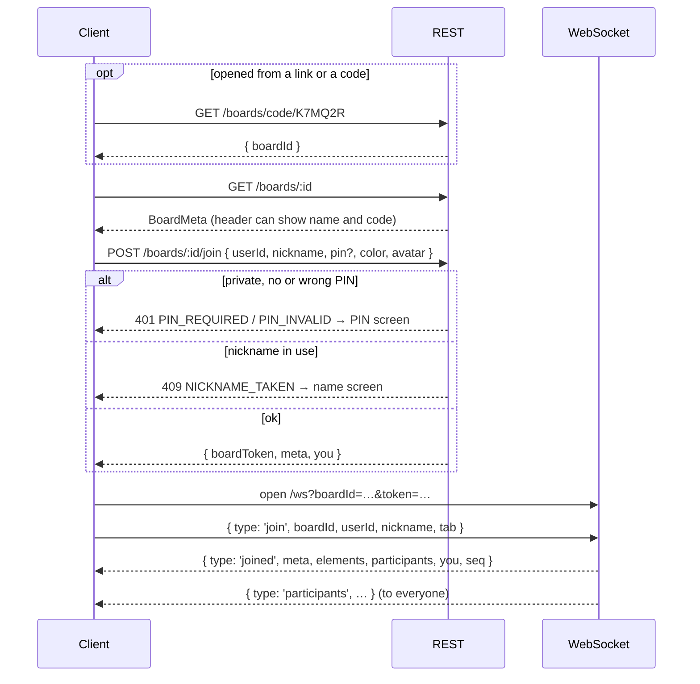
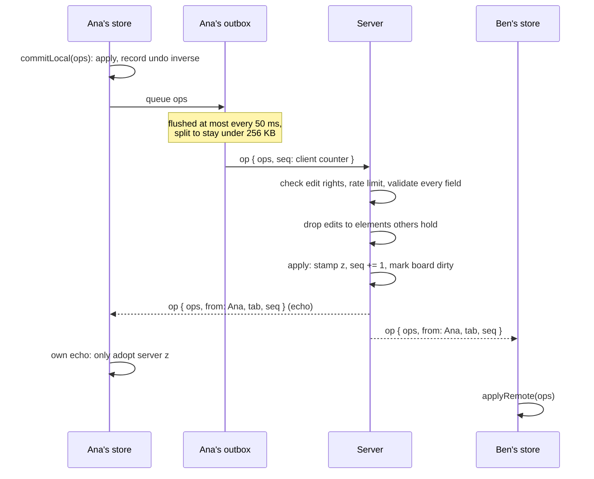
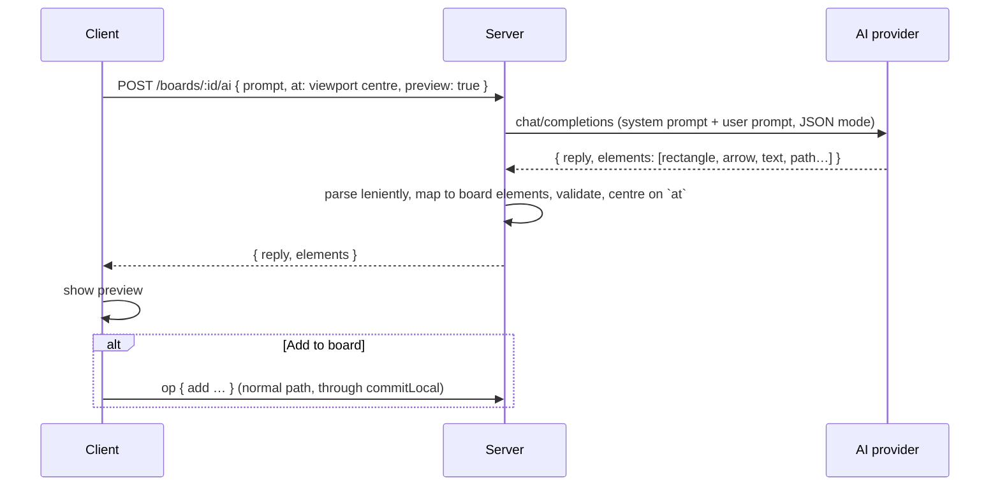

# Communication: REST and WebSocket

The apps talk to the server in two ways:

- **REST (HTTPS + JSON)** for everything that is a single request: creating,
  finding and joining a board, permissions, renaming, deleting, export, import
  and AI drawings.
- **One WebSocket per open board** for everything live: operations, cursors,
  presence, selections and permission changes.

Production server: `https://shareboard-server.onrender.com` (WebSocket at
`wss://shareboard-server.onrender.com/ws`).

## Identity and authentication

There are no accounts and no passwords. Three credentials exist:

| Credential | What it is | Sent as |
|------------|------------|---------|
| **User id** | A UUID each device generates once and keeps | `X-User-Id` header, and in join bodies |
| **PIN** | 4 digits, only for private boards | In the join body |
| **Board token** | Issued by `POST /boards/:id/join`, valid 12 hours, for one board | `?token=` on the WebSocket URL; `Authorization: Bearer …` on owner and member routes |

The board token is `base64url(JSON payload) + "." + HMAC-SHA256 signature`,
signed with the server's `TOKEN_SECRET`. Its payload is
`{ boardId, userId, role, exp }`. The server checks the signature (in constant
time), the expiry, and that the token belongs to the board in the URL.
Permissions are always re-evaluated from the board's current settings, never
taken from the token's `role`.

## REST API

Base URL: the server root. All bodies are JSON.

| Method and path | Auth | Purpose | Answer |
|-----------------|------|---------|--------|
| `GET /health` | — | Liveness, database and version | `{ ok, db, version }`; 503 if MongoDB is down |
| `POST /boards` | `X-User-Id` | Create a board `{ name, access, editPolicy, pin?, creatorId }` | 201 + `BoardMeta` |
| `GET /boards/:id` | — | Board metadata | `BoardMeta` |
| `GET /boards/code/:code` | — | Resolve a short code | `{ boardId }` |
| `POST /boards/:id/join` | — | Join `{ userId, nickname, pin?, color?, avatar? }` | `{ boardToken, meta, you }` |
| `PATCH /boards/:id` | creator token | Rename `{ name }` | `BoardMeta` |
| `PATCH /boards/:id/permissions` | creator token | `{ access?, editPolicy?, editors?, pin? }`; `pin: null` removes it | `BoardMeta` |
| `DELETE /boards/:id` | creator token | Delete the board, disconnect everyone | 204 |
| `GET /boards/:id/snapshot` | board token | Server-side export | `BoardSnapshot` |
| `POST /boards/import` | `X-User-Id` | New board from `{ snapshot, creatorId }` | 201 + `BoardMeta` |
| `POST /boards/:id/ai` | board token, edit rights | Draw with AI `{ prompt, at, preview: true }` | `{ reply, elements }` |
| `POST /ai` | `X-User-Id` | Draw with AI for an offline board `{ prompt, at }` | `{ reply, elements }` |

### Errors

Every error, REST or WebSocket, has the same shape:

```json
{ "error": { "code": "PIN_INVALID", "message": "Incorrect PIN" } }
```

| Code | HTTP | When |
|------|------|------|
| `VALIDATION` | 400 | A field is missing, of the wrong type, or the board is full |
| `PIN_REQUIRED` | 401 | Private board, no PIN given |
| `PIN_INVALID` | 401 | Wrong PIN |
| `FORBIDDEN` | 403 | Not the creator, no edit rights, or a bad token |
| `BOARD_NOT_FOUND` | 404 | Unknown board, code or route |
| `NICKNAME_TAKEN` | 409 | Someone on the board uses that name |
| `RATE_LIMITED` | 429 | Too many requests (see below) |
| `INTERNAL` | 500 | Anything unexpected, including AI provider failures |

### Rate limits

| What | Limit | Keyed by |
|------|-------|----------|
| Create or import a board | 10 per hour | IP address |
| PIN attempts | 5 per minute | IP address + board |
| AI drawings | 10 per minute | user (and IP for `/ai`) |
| WebSocket ops | 60 messages per second | user + board |

### CORS

The server answers browsers from the origins listed in `CORS_ORIGIN` (or any
origin with `*`), for `GET HEAD POST PATCH DELETE OPTIONS` and the headers
`Content-Type`, `Authorization`, `X-User-Id`.

## Opening a board



The board is shown only after `joined`. Until then the client shows a
loading screen with the name it got from REST.

## WebSocket protocol

URL: `wss://<server>/ws?boardId=<id>&token=<boardToken>`. Messages are JSON
text frames of at most 256 KB. The first message must be `join`; anything else
before it is refused.

### Client → server

| Message | Purpose |
|---------|---------|
| `{ type: 'join', boardId, userId, nickname, pin?, tab? }` | Enter the board. Sent on every (re)connect |
| `{ type: 'op', boardId, ops: Op[], seq }` | A batch of changes. `seq` is the client's own counter |
| `{ type: 'cursor', boardId, at: Point }` | Where my pointer is (board coordinates) |
| `{ type: 'select', boardId, ids: string[] }` | What I have selected, and therefore hold |
| `{ type: 'leave', boardId }` | I am leaving; the server closes the socket |
| `{ type: 'ping', t }` | Heartbeat |

`tab` is a random id per browser tab or app session. It lets one person keep
several sockets on the same board (two tabs, laptop and phone) while a
reconnect from the *same* tab replaces its old socket.

### Server → client

| Message | Purpose |
|---------|---------|
| `{ type: 'joined', meta, elements, participants, you, seq }` | The whole board, once per connection |
| `{ type: 'op', ops, from, tab?, seq }` | Changes, broadcast to everyone including the sender. `from: 'server'` is a correction, `from: 'ai'` an AI drawing |
| `{ type: 'participants', participants }` | Who is here, their roles and selections |
| `{ type: 'cursor', from, at }` | Someone's pointer (never echoed to its sender) |
| `{ type: 'permissions', meta, you }` | Permissions changed; `you` carries my new role |
| `{ type: 'resync', elements, seq }` | The real board, after a batch of mine was refused |
| `{ type: 'error', code, message }` | Same codes as REST |
| `{ type: 'pong', t }` | Heartbeat answer |

### Close codes

| Code | Meaning | Client reconnects? |
|------|---------|--------------------|
| 1000 | Normal (left the board) | No |
| 4000 | Bad request (invalid token, message too large) | No |
| 4001 | Replaced by a newer socket from the same tab | No |
| 4003 | Forbidden | No |
| 4004 | Board not found or deleted | No |
| 4008 | Rate limited | Yes |
| 4009 | PIN required | No |
| other (1006…) | Network trouble | Yes, with backoff |

## How a change travels



Step by step:

1. **Local first.** Every change on a client goes through one function,
   `commitLocal`. It applies the ops to the local board (so the stroke is on
   screen at once), pushes their inverse onto the undo stack, and appends them
   to the **outbox**.
2. **Batching.** The sync layer drains the outbox at most every 50 ms and
   sends one `op` message per batch, split into chunks so a message with
   pasted images never exceeds the 256 KB frame limit.
3. **Server checks.** The server refuses ops from viewers (`FORBIDDEN`),
   rate-limits, and validates every element and patch field by field (unknown
   fields dropped, numbers clamped into range).
4. **Ordering.** The server applies the batch to its copy, assigns each added
   element the next `z` (so two people drawing at once never get the same paint
   order), increments the board's `seq`, and schedules a save.
5. **Broadcast.** The same ops go to every socket on the board, the sender
   included, tagged with `from`, `tab` and `seq`.
6. **Echo.** A client recognises its own echo (`from` is me and `tab` is this
   tab). It does not apply the ops again; it only adopts the `z` the server
   chose. Other clients apply the ops normally. Remote ops never enter the undo
   history.

### Selection locks

When a person selects elements, the client sends `select` with their ids. The
server grants only ids nobody else holds (first come, first served) and
broadcasts the result in `participants`. Others see those elements as taken
and cannot select them. If an `update` or `delete` for a held element still
arrives, the server drops it and sends the sender an `op` from `server` with
the element's real state, so its optimistic copy snaps back. Viewers never
hold anything. Leaving the board, or deselecting, releases the hold.

### When a batch is refused

If the server rejects a whole batch (no edit rights, board full, invalid
element), it sends an `error` and then a `resync` with the board as it really
is. The client replaces its elements with the server's, re-applies whatever is
still in its outbox, and clears its undo history.

### Cursors

Pointer positions are sent at most every 45 ms, in board coordinates, so each
viewer places them correctly whatever their own zoom. The server forwards them
to everyone except the sender and never stores them.

### Permissions changes

`PATCH /boards/:id/permissions` recomputes every connected person's role and
pushes a `permissions` message to each socket. A person who lost edit rights
sees their tools disappear immediately.

### Deleting a board

`DELETE /boards/:id` sends every socket an `error BOARD_NOT_FOUND`, closes it
with 4004 (so no client tries to reconnect), and removes the board from memory
and MongoDB.

## Staying connected

- **Heartbeat.** Clients send `ping` every 20 s. If nothing at all has arrived
  for two intervals, the client drops the socket itself: a phone that lost
  Wi-Fi can keep a dead socket "open" for minutes. The server drops a socket
  that has been silent for 40 s.
- **Reconnect.** Exponential backoff from 0.5 s, doubling up to 15 s, with up to
  30 % random jitter so many devices do not reconnect on the same tick. After 5
  failed attempts the client stops and shows **Retry**.
- **Coming back.** Returning to the tab or the app, or the device going back
  online, reconnects immediately.
- **Fresh state.** Each reconnect is a new socket: it sends `join` again,
  receives the full board in `joined`, and re-sends its selection. Ops queued
  while offline stay in the outbox and go out after `joined`.
- **Offline is read-only.** While a live board is offline, `commitLocal`
  refuses changes, so nothing is drawn that would be lost on reconnect.

## Draw with AI



The AI never writes to the board directly: the client adds the elements as
its own ops, so they are undoable and go through the same checks. Details in
[Server internals](server.md#draw-with-ai).

## The in-app updater (Android)

On launch, a release build of the app asks GitHub for the releases of
`Juan17la/shareboard_mobile`. If a release has a higher version than the
running build (pre-releases ordered correctly: `1.0.0-beta.2 < 1.0.0-beta.10 <
1.0.0`) and carries an `.apk`, the app offers it with the first lines of its
release notes.
