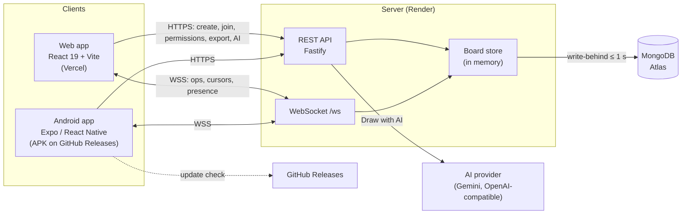
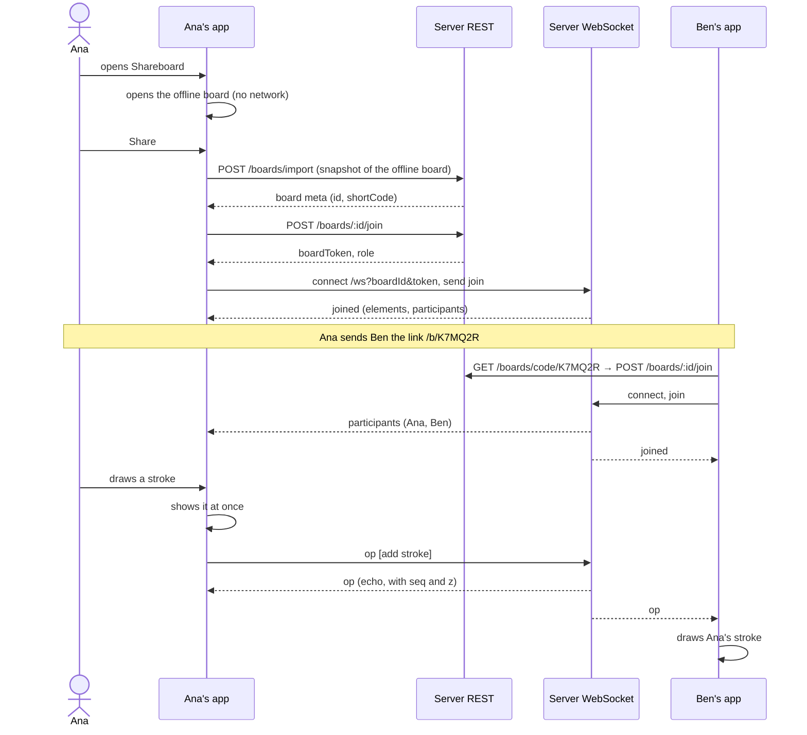

# Architecture overview

## The idea in one paragraph

A board is a list of **elements** (strokes, figures, text, images). Every change
anyone makes is expressed as a small **operation** ("add this element",
"change these fields of that one", "delete that one"). A client applies its own
operation on screen immediately, then sends it to the server over a
WebSocket. The server checks it, stamps it with the board's sequence number,
stores it, and broadcasts it to everyone on the board, including the sender.
Every client applies the same operations, so every screen converges on the
same board.

## The three projects

| Project | Stack | Runs on | Role |
|---------|-------|---------|------|
| `server/` | Node 22, Fastify 5, `ws`, MongoDB driver | Render (one instance) | Single source of truth: validates and orders every change, holds live boards, persists them, hosts presence, talks to the AI provider |
| `web/` | React 19, Vite, Tailwind 4, Canvas 2D | Vercel (static SPA) | Full client for any browser |
| `mobile/` | Expo 57, React Native 0.86, Skia, Reanimated, Gesture Handler | Android | Full client for phones and tablets |

The three projects **share no code at build time**. They agree only on the
wire contract: the [data model](data-model.md) and the
[REST and WebSocket protocol](communication.md). Each keeps its own copy of the
types:

| | Model types | Protocol types |
|---|---|---|
| server | `src/model/types.ts` | `src/model/protocol.ts` |
| web | `src/lib/contract.ts` | same file |
| mobile | `src/features/board/model.ts` | `src/services/realtime/protocol.ts` |

A change to the contract is made in all three. The same goes for logic the two
clients both need (the board store, geometry, export/import, the
image-embedding format): web and mobile hold twin implementations that are kept
in step by hand. A fix to one is ported to the other.

## Key design decisions

**No accounts.** Each device generates a random, persistent user id (a UUID)
the first time it runs. The id identifies a person for presence,
roles and "who created this board". A private board is protected by a PIN,
not by a login. This keeps the entry cost at zero: open the link, draw.

**The server is the authority, the clients are optimistic.** A client never
waits for the server to show a change, but the server decides what is real:
it checks permissions, validates every field, assigns the paint order (`z`),
refuses edits to elements someone else holds, and tells a client to resync
when its optimistic state went wrong.

**Operations, not snapshots.** Clients send small ops (an added stroke, a
patch of changed fields), not the whole board. Ops are idempotent, so applying
the same op twice is harmless. That makes reconnects and echoes simple.

**Last write wins per field.** Two people editing different fields of the same
element both win. Two people editing the same element at the same moment is
prevented by **selection locks**: whoever selects it first holds it.

**Memory first, database behind.** A live board is served from memory and
written to MongoDB within one second of each change. A board nobody uses is
dropped from memory after five minutes and loaded again from MongoDB on the
next visit.

**The camera is personal.** Pan and zoom never travel over the network. Each
person looks at the board their own way.

**Offline first on the device.** Each device has one board that lives only
there (IndexedDB on the web, a file on Android). The app opens on it, so there
is always something to draw on, with or without a server. Sharing it uploads a
copy.

**Exports stay editable.** An exported PNG or JPG carries the board's JSON in a
metadata chunk, so a picture sent by chat can be imported back as an editable
board on either client.

## How a typical session flows

## Deployment at a glance

| Piece | Where | Deployed by |
|-------|-------|-------------|
| Server | Render web service `shareboard-server` (`render.yaml`), health check `/health` | Push to `main` (or the Render deploy hook) |
| Database | MongoDB Atlas, database `shareboard`, collection `boards` | — |
| Web | Vercel project `shareboard-web` (`vercel.json`, SPA rewrite) | Push to `main` |
| Android app | APK attached to the GitHub release of `shareboard_mobile` | `git_scripts/release.sh` |

All three projects carry the **same version number** and are released
together. See [Releasing](../development/releasing.md).

## Read next

- [Data model](data-model.md): what a board, an element and an op look like.
- [Communication](communication.md): every REST endpoint and WebSocket message.
- [Server internals](server.md) and [client internals](clients.md).
