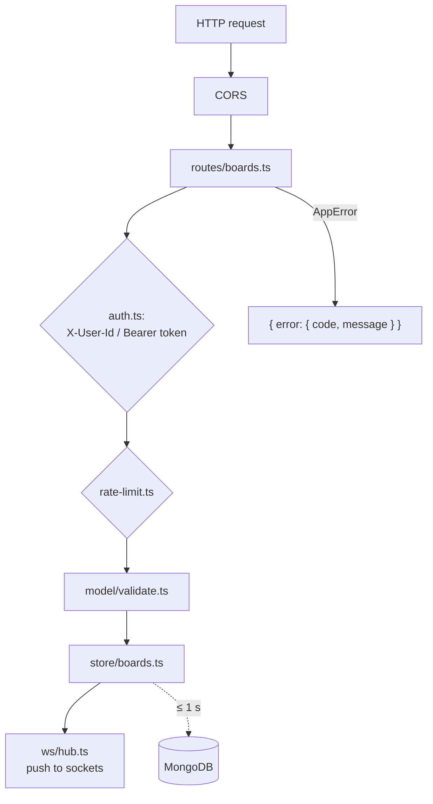

# Server internals

Repository: [shareboard_server](https://github.com/Juan17la/shareboard_server).
Node 22, Fastify 5, `@fastify/websocket` (the `ws` library), the official
MongoDB driver. About 2,300 lines of TypeScript and four runtime dependencies.

## Layout

```
src/
  index.ts          startup: connect MongoDB, start timers, listen, flush on exit
  app.ts            Fastify instance: CORS, error envelope, routes
  config.ts         every environment variable, with defaults
  errors.ts         AppError and the { error: { code, message } } envelope
  tokens.ts         board tokens (HMAC-SHA256)
  pin.ts            PIN hashing (scrypt + salt)
  rate-limit.ts     fixed-window counters in memory
  ai.ts             "Draw with AI"
  model/
    types.ts        the data model and limits
    protocol.ts     WebSocket messages, close codes, realtime limits
    rules.ts        roleFor / canEdit
    ops.ts          applying ops, paint order
    validate.ts     validation of every request body, element and patch
    short-code.ts   generating and normalising codes
  routes/
    boards.ts       every REST endpoint
    auth.ts         X-User-Id and Bearer token helpers
  store/
    boards.ts       live boards in memory, write-behind, eviction
    mongo.ts        MongoDB access
  ws/
    index.ts        the socket handler
    hub.ts          which sockets are on which board, broadcast
test/               smoke.mjs, persistence.mjs, patch.mjs, ai.mjs
```

## Request flow



Any `AppError` thrown anywhere becomes the error envelope with the right HTTP
status. Unknown routes answer `BOARD_NOT_FOUND`. Unexpected errors are logged
and answered as `INTERNAL`, never leaking a stack trace.

## The board store (`store/boards.ts`)

Each board in use is an `ActiveBoard` in a `Map`:

```ts
interface ActiveBoard {
  meta: BoardMeta;
  pinHash: string | null;
  elements: Map<string, BoardElement>;
  participants: Map<UserId, Participant>;
  seq: number;          // increments on every applied batch
  topZ: number;         // highest paint order in use
  lastActivityAt: number;
  dirty: boolean;       // has changes not yet in MongoDB
}
```

**Hot or cold.** `getBoard(id)` returns the board from memory if it is there.
Otherwise it loads it from MongoDB. Two sockets joining the same cold board at
the same moment share one load (an in-flight promise map), so they end up on
the same object.

**Creating.** A new board gets an id (`brd_` + 12 hex), a short code that is
checked against both memory and MongoDB, and is **saved before its id is
returned**. A board that anyone knows about always exists in the database.

**Write-behind.** Every change calls `touch(board)`, which marks it dirty and
starts a timer of `WRITE_DELAY_MS` (1 s) if none is running. When it fires, the
whole board document is replaced in MongoDB. Consequences:

- a burst of edits becomes one write;
- a crash or redeploy loses at most one second of changes;
- writes to one board never overlap: a save waits for the previous one, so an
  older snapshot can never land after a newer one;
- the dirty flag is cleared *before* the write, so a change made during the
  write is saved by the next one;
- a failed write keeps the board dirty and retries after 5 s.

**Eviction.** Every minute a sweeper looks for boards with nobody connected and
no activity for 5 minutes. It saves them and only then drops them from memory.

**Shutdown.** On `SIGTERM` / `SIGINT` the server stops accepting connections,
saves every dirty board, closes MongoDB and exits. Render sends `SIGTERM` to
the old instance during a deploy, after the new one passes its health check.

**Deleting.** The board leaves memory and the code index first, then the
server waits for any in-flight save (which would otherwise bring it back) and
deletes the document.

**`MEMORY_ONLY=true`** runs without a database for throwaway tests. Without it,
a missing `MONGO_URL` stops the server at startup on purpose: silently losing
every board on restart is worse than not starting.

## The socket handler (`ws/index.ts`, `ws/hub.ts`)

- The token in the URL is verified before anything else; a bad one closes the
  socket with 4000.
- `join` validates the nickname, registers the socket in the hub (replacing an
  older socket from the same user *and tab* with close 4001), adds the
  participant, sends `joined`, and broadcasts `participants`.
- `op` goes through: edit rights → rate limit (60/s) → validation → selection
  locks → element limit → `applyOps` → `seq += 1` → `touch` → broadcast.
- `select` grants only ids nobody else holds; viewers hold nothing.
- `cursor` updates presence and forwards it to everyone else.
- An error in a handler is sent back as an `error` frame. If it was an `op`, a
  `resync` follows. `BOARD_NOT_FOUND` also closes the socket.
- A socket silent for 40 s is terminated.
- On close, the participant is removed, unless the same user still has another
  socket on the board (another tab or device).

`hub.ts` is a `Map<boardId, Set<Client>>`. REST routes use it too, to push
`permissions` changes or to close everyone's socket when a board is deleted.

## Applying ops (`model/ops.ts`)

- `add`: `z = topZ + 1`, written into the op itself so the broadcast carries
  the same value every client will use.
- `update`: shallow merge, `null` deletes a key, and a `z` raised by "bring to
  front" moves `topZ` up so the next add lands above it.
- `delete`: soft delete (`deleted: true`).
- `clear`: empties the map, resets `topZ`.

`visibleElements` (what `joined` and snapshots return) filters deleted
elements and sorts by `z`.

## Validation (`model/validate.ts`)

Every element, patch, board body, permission change and snapshot is validated
by hand-written checks. No schema library is used. The rules:

- required fields must have the right type, otherwise `VALIDATION`;
- numbers are clamped into their range (width 1–64, font 10–400, sides 4–12,
  opacity 0.1–1…);
- colours must match `#RRGGBB` or `#RRGGBBAA`;
- enums (shapes, markers, routes, fonts…) must be a known value;
- unknown fields are **dropped**, not stored and not broadcast;
- a stored board with an out-of-range value (from an older version) is
  brought into range when it loads instead of being refused.

## Security measures

| Threat | Measure |
|--------|---------|
| Guessing a PIN | 5 attempts per minute per IP and board; scrypt hashing |
| Reading the PIN | Stored only as `salt:hash`; `BoardMeta` only says `hasPin` |
| Forged tokens | HMAC-SHA256 with `TOKEN_SECRET`, constant-time compare, 12 h expiry, bound to one board |
| Board spam | 10 creations per hour per IP |
| Flooding a board | 60 op messages per second per user; 256 KB message cap; 5,000 elements per board |
| Malformed data | Field-by-field validation; unknown fields dropped |
| Editing someone's selection | Selection locks enforced on the server |
| Cross-site calls | CORS restricted to `CORS_ORIGIN` in production |

## Draw with AI (`ai.ts`)

The server sends the prompt to any **OpenAI-compatible** chat endpoint.
Presets:

| `AI_PROVIDER` | Endpoint | Default model |
|---------------|----------|---------------|
| `gemini` (default) | Google Generative Language, OpenAI-compatible | `gemini-flash-latest` |
| `groq` | api.groq.com | `openai/gpt-oss-120b` |
| `openrouter` | openrouter.ai | `openrouter/free` |
| `ollama` | localhost:11434 | `llama3.2` |

`AI_MODEL` and `AI_BASE_URL` override the preset. Prefer model aliases
(`…-latest`, routers): free models are retired often.

The system prompt asks for a JSON object with a short `reply` and a list of
simple items drawn in an 800 × 600 box: rectangles, ellipses, triangles,
polygons, lines and arrows *between figures by id*, text, and freehand paths.
The answer is parsed leniently (code fences and one bad item do not spoil the
rest), each item becomes a real board element, arrows between figures become
**linked** arrows, everything is validated like any client element, and the
drawing is moved so it is centred on the point the client sent (the middle of
the user's screen). At most 200 elements, 60 s timeout, temperature 0.4.

## Configuration

| Variable | Default | |
|----------|---------|--|
| `PORT`, `HOST` | `3000`, `0.0.0.0` | |
| `MONGO_URL` | — | Required unless `MEMORY_ONLY=true` |
| `MONGO_DB` | `shareboard` | |
| `MONGO_POOL_SIZE` | `20` | |
| `WRITE_DELAY_MS` | `1000` | Write-behind window |
| `TOKEN_SECRET` | `dev-secret-change-me` | Set a real one in production (Render generates it) |
| `CORS_ORIGIN` | `*` | Comma-separated origins |
| `AI_PROVIDER`, `AI_API_KEY`, `AI_MODEL`, `AI_BASE_URL` | `gemini`, —, —, — | |
| `MEMORY_ONLY` | `false` | Throwaway runs |

## Scaling beyond one instance

One instance holds every live board, which is plenty for around a hundred
concurrent users. Three pieces are per-process today, each marked with a
`ponytail:` comment in the code, and would change to run several instances:

1. `ws/hub.ts`: broadcast through a Redis channel per board.
2. `rate-limit.ts`: count with Redis `INCR` + `PEXPIRE`.
3. The load balancer routes each board id to one instance (sticky), so
   `store/boards.ts` keeps a single live copy.

MongoDB stays the source of truth either way.

## Checks

| Command | What it checks |
|---------|----------------|
| `npm run typecheck` | TypeScript |
| `npm run smoke` | End to end against a running server: create, join, socket, ops, delete |
| `npm run check:persistence` | Write-behind, eviction and reload |
| `npm run check:patch` | Patch validation |
| `npm run check:ai` | Parsing AI answers into elements |
